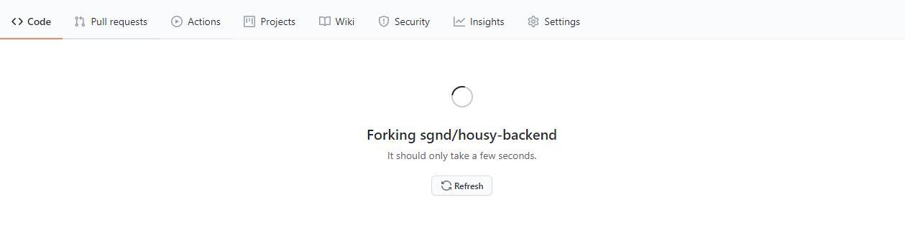
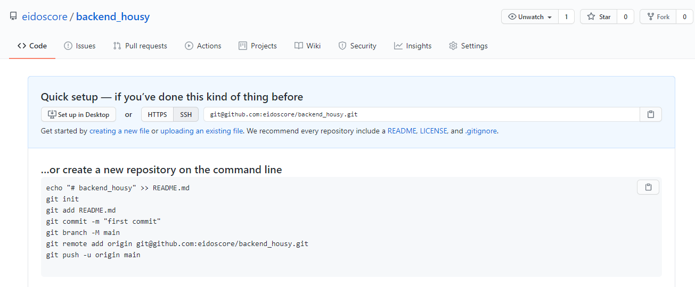
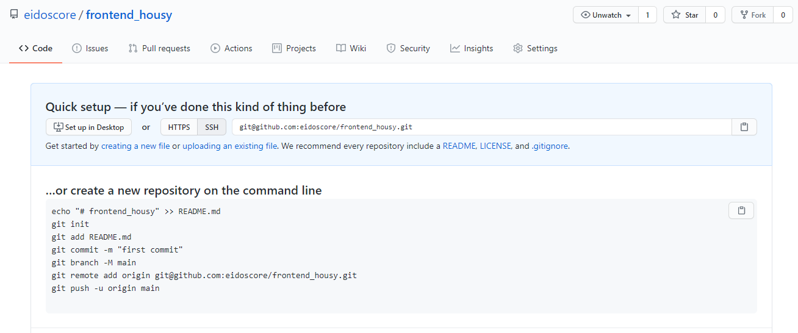
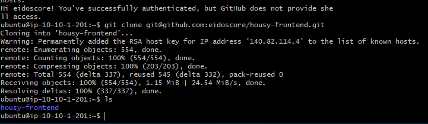
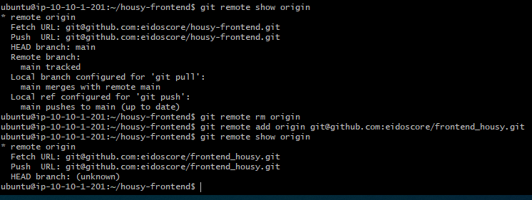
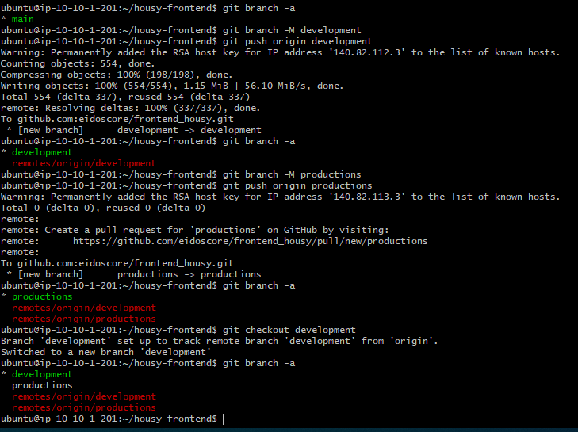
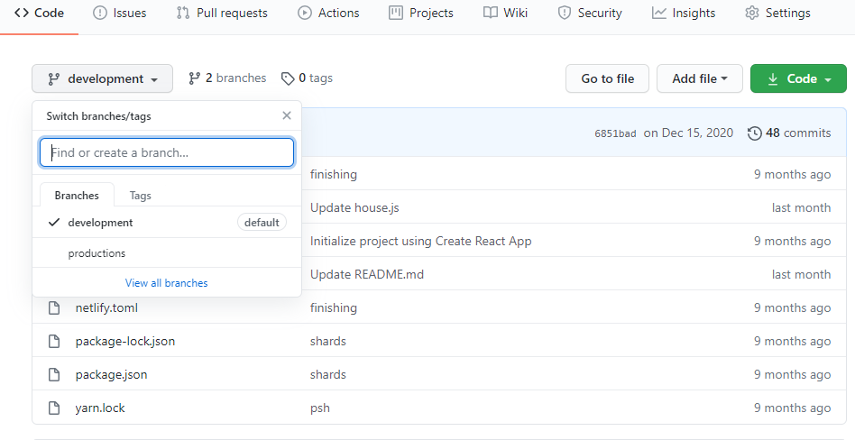

# Repository

1. Lakukan forking pada repository housy frontend dan backend

2. buat repository baru frontend dan backend

3. clone repo pada server backend/frontend

3. rubah alamat remote origin repository yang sudah di clone

4. buat branch baru **Development** dan **Production** pada repository

5. push ke repository baru kita yang sudah dibuat sebelumnya

