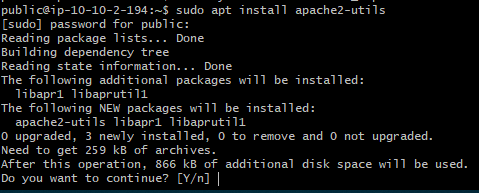
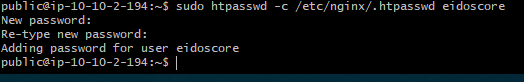
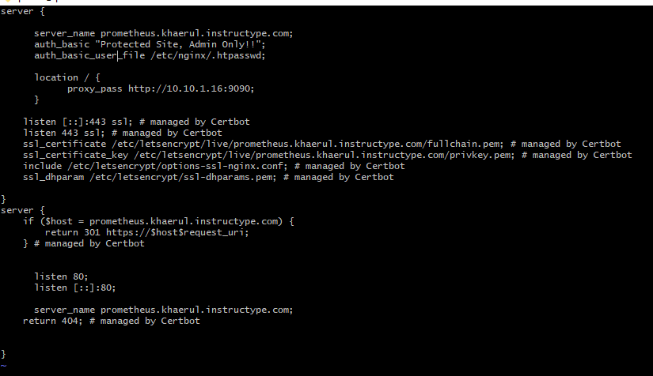
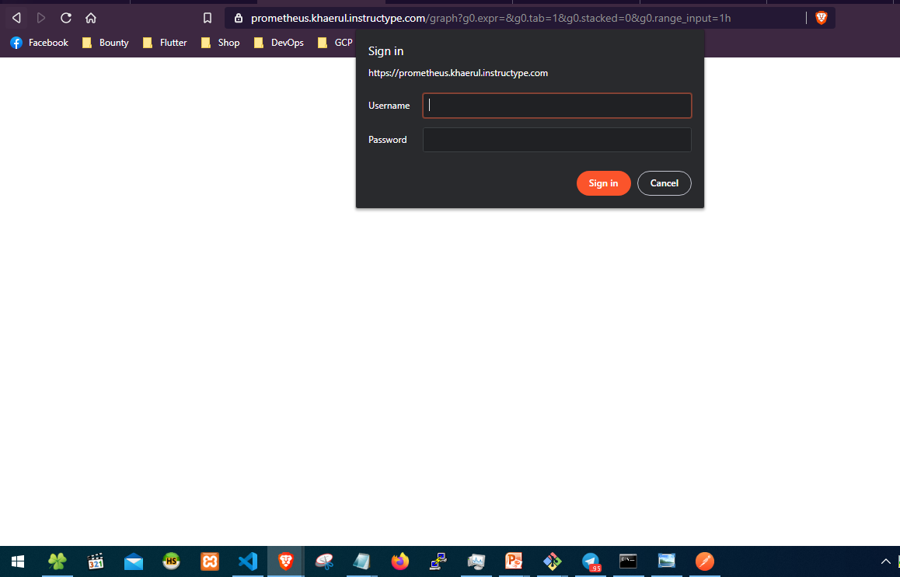
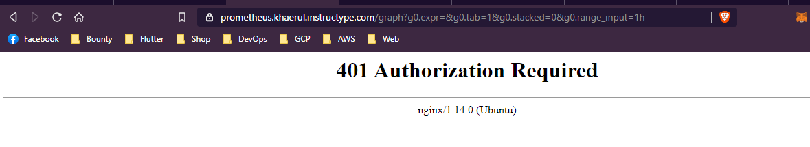

# Authentication

pada tahap ini kita akan mengamankan sub domain dari prometheus agar tidak sembarang orang bisa mengaksesnya dan agar lebih aman asal, karna prometheus defaultnya tidak memiliki authentiation jadi kita akan menambahkan sendiri authentikasinya menggunakan htpasswd

1. pertama install htpasswd dengan command ```sudo apt install apache2-utils``` dan bua basic auth pada direktori ```/etc/nginx/.htpasswd``` kemudian tambahkan script berikut pada config prometheus dan restart.





2. akses prometheus menggunakan web browser, jika konfigurasi sudah maka akan muncul prompt untuk memasukan username dan password yang sudah dibuat sebelumnya.



3. jika user tidak memasukan password dan mengklik cancel button maka akan diarahkan pada halaman ```401 Unauthorized```.

