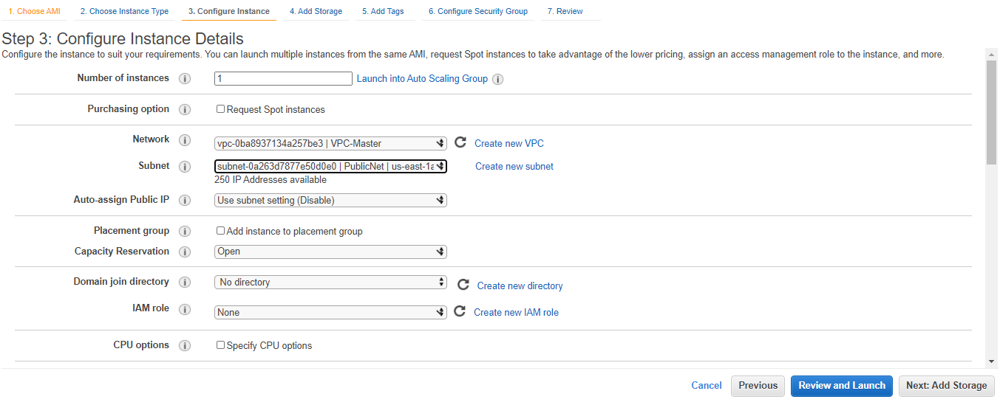

# Server Configuration

1. buat VPC baru berinama, disini saya berinama VPC-Master
    IPV4 : 10.10.0.0/16

2. buat private/public subnet
    Public Subnet : 10.10.2.0/24
    Private Subnet : 10.10.1.0/24

2. buat internet gateway baru, IG digunakan agar instances dapat terhubung ke internet

3. buat 2 Route table kemudian hubungkan masing-masing route ke ke VPC-MAster

4. asosiasikan route table yang sudah Public-RT ke Public Subnet

5. but Nat Gateway kemudian hubungkan Private-RT pada Nat Gateway tadi dengan cara diasosiasikan.

6. but Nat Gateway kemudian hubungkan Private-RT pada Nat Gateway tadi dengan cara diasosiasikan.

7. Buat Instance Baru Public Serveruntuk masing-masing server

buat elastic IP dan asosiasikan ke Public Instances yang baru dibuat agar memiliki ip yg tetap.

8. Buat Instances lainnya disini dibedakan hanya gunakan private subnet dan tambahkan security group berikut : 

