# User Setting

1. akses instances yang sudah kita buat dan tambahkan user baru pada masing-masing server 

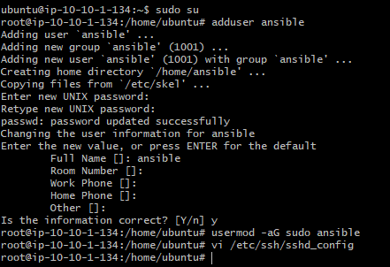

2. disable PAsswordauthentication pada ```sshd_config``` dan restart services dan relogin

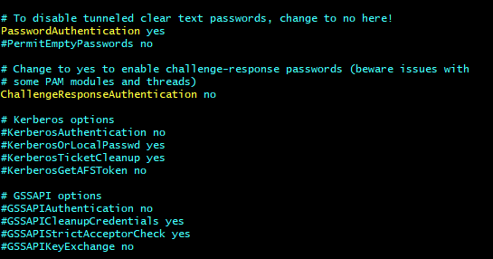
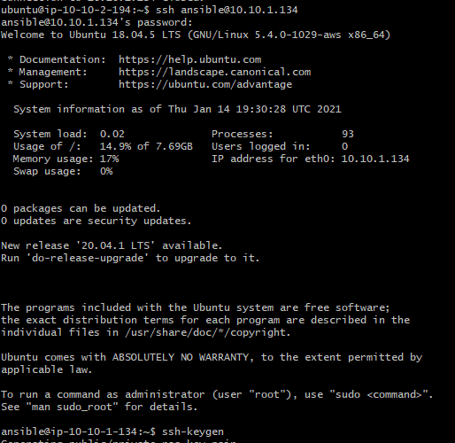

3. buat ssh key dan tambahkan public key ke akun github kita 

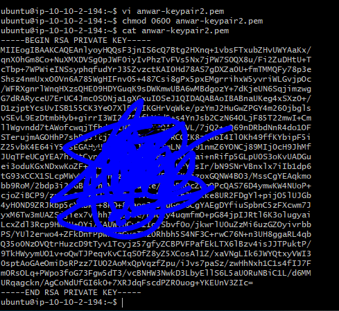
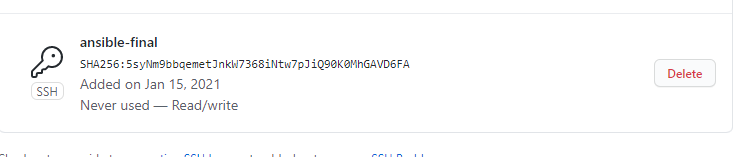

4. lakukan test koneksi ke github dan clone ansbible repo menggunakan ssh

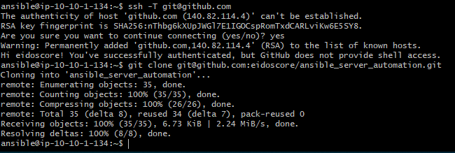

5. buat file ```inventory``` yang berisikan host masin-masing server, kemudian buat file ```ansible.cfg```

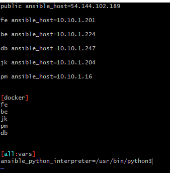
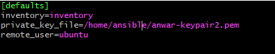

6. lakukan update pada server dan install ansible pada server ansible, setelah itu lakukan ping 

```ansible all -i inventory -m ping ```

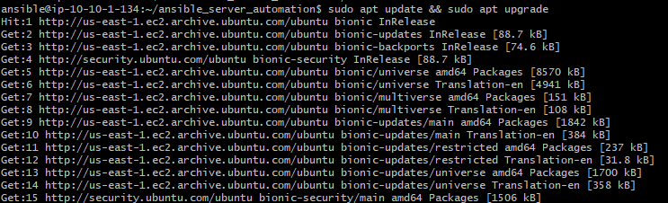
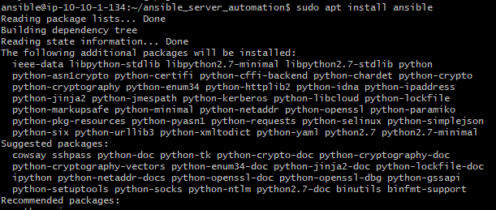
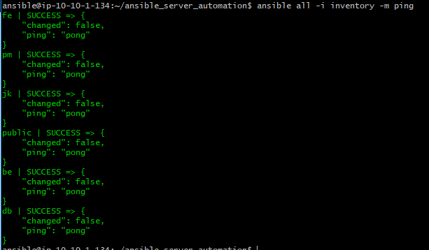

7. Install aplikasi mkpasswd untuk encrytp password user, dan jalankan script untuk membuat user pada masing-masing server dan lakukan login ke server tujuan

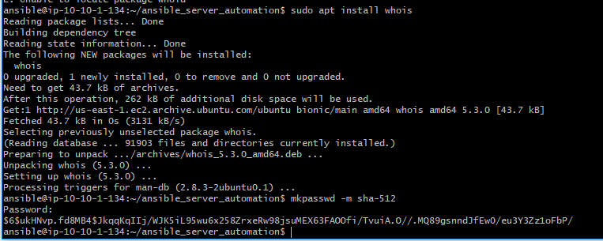
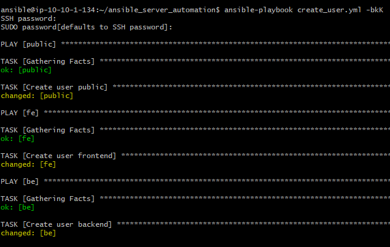
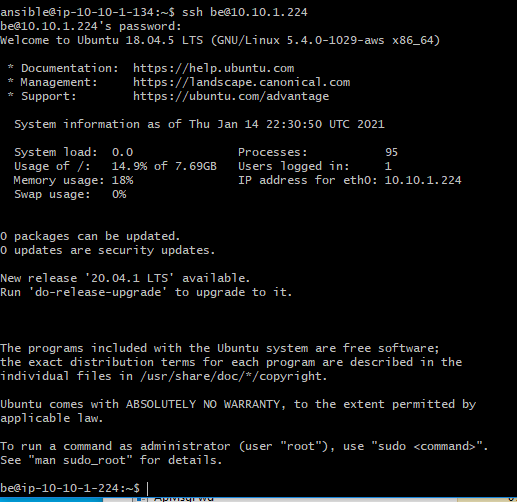
