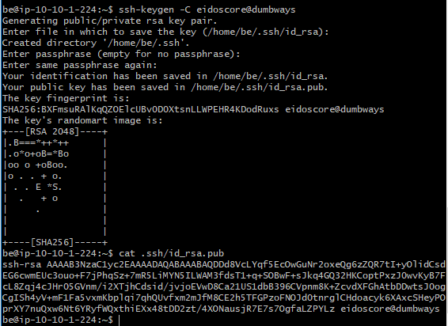
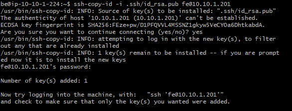
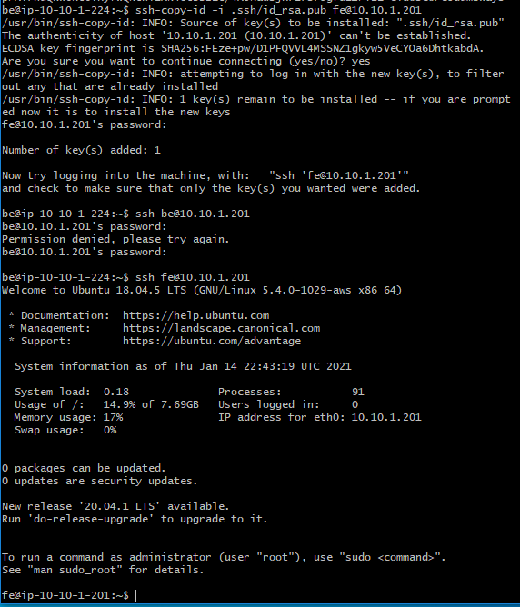
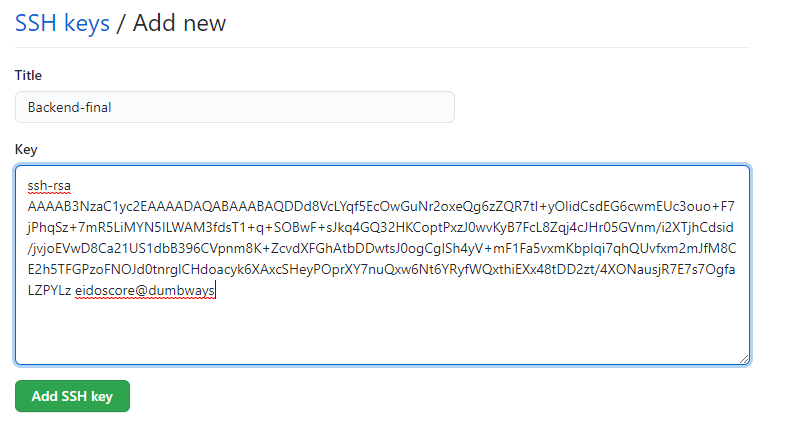
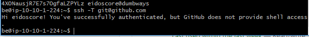

# SSH

1. buat ssh key pada masing-masing server, kemudian ssh public key dari server ansible ke masing-masing server lainnya dengan cara ```ssh-copy-id -i .ssh/id_rsa.pub user@host```




2. Lakukan login ke server lainnya dari server ansible, dan tambahkan public key dari server frontend/backend ke akun github kita.



