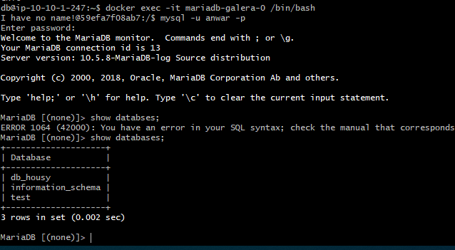

# Database Server

1. jalankan script berikut untuk membuat galeraDatabase Cluster pada server database


2. kemudian jalankan akses database yang berjalan pada container docker, untuk proses proses instalasi docker ada pada step 7. Deployment.



3. selanjutnya Haproxy untuk melakukan load balancing database, dan tambahkan script balancing pada ```haproxy.cfg``` kemudian restart service


4. akses database melalui server backend, pertama install mysql client dan renote database.


