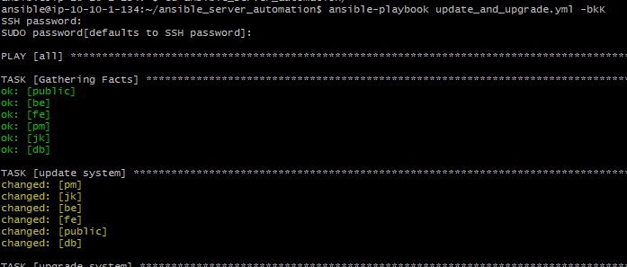

# Web Server

1. Buka ip dari public dan disini dipastikan bahwa nginx belum terinstall pada server

cek koneksi kembali karna pada bagian user kita sudah membuat user baru dan login menggunakan akun yg sudah maka hasilnya akan unreachable ketika mencoba ping ke server lainnya, jadi kita perlu edit inventory dan file ansible.

2. pertama copy public key ansible server ke masing-masing server dan lakukan ping kembali.

3. lakukan update dan upgrade pada semua server.

4. kemudian install Nginx pada web server.

5. Rubah ip pada domain di dashboard cludflare dengan ip wev server kita.

6. lakukan reverse proxy server.

