# Deployment

1. langkah pertama adalah menginstall Docker menggunakan ansible.

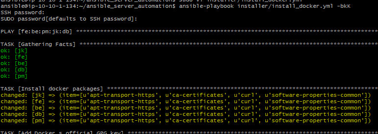
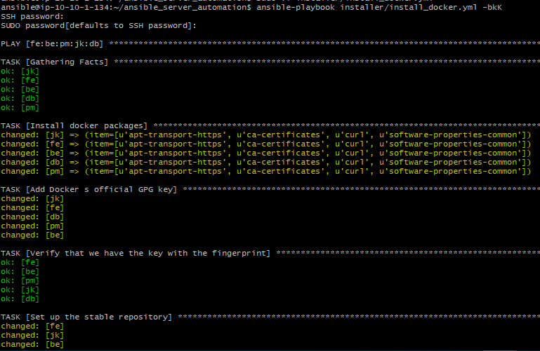

2. Install nodejs pada server frontend/backend dan lakukan ```npm install``` setelah itu install ```sequelize-cli```

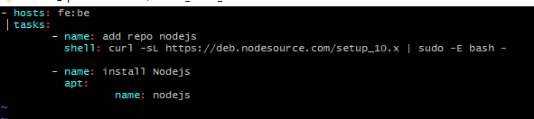
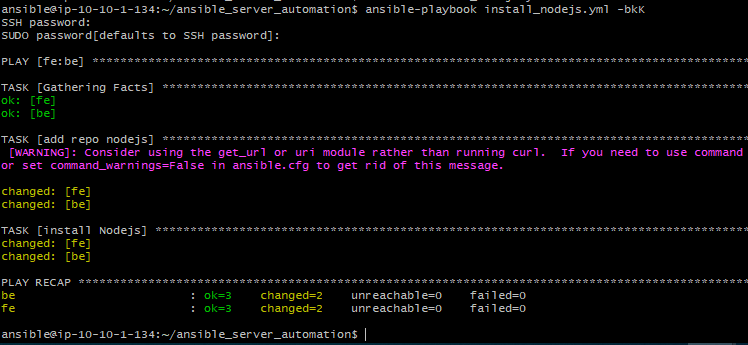
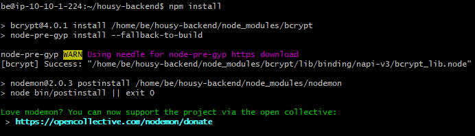
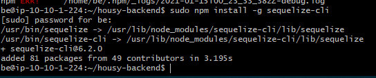

3. pada server frontend rubah api dan arahkan ke backend, sementara pada backend rubah config database dan sesuaikan dengan database yang sudah dibuat pada bagian 5. Database, setelah lakukan migrasi database.

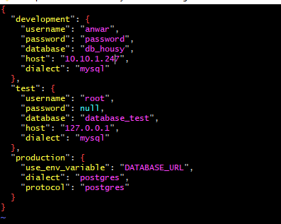
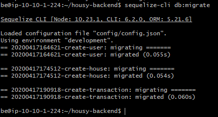

4. berikutnya buat Dockerfile dan build image backend untuk menjalankan image backend pada Docker container.

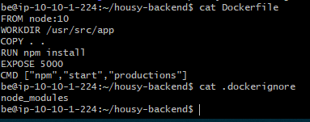
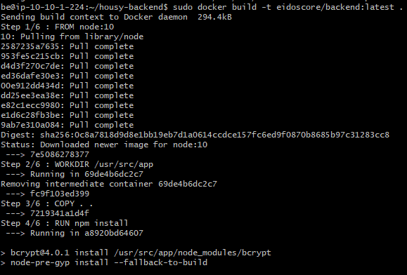
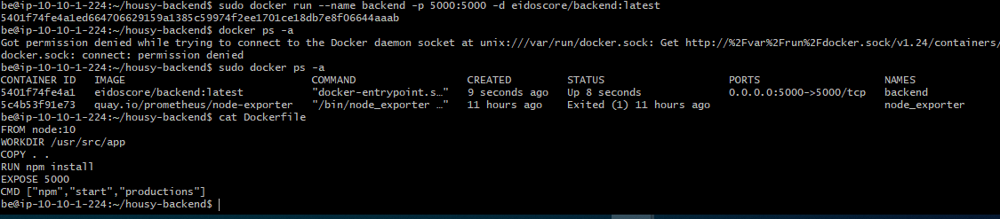

5. setelah semua step sudah selesai akses aplikasi melalui browser.

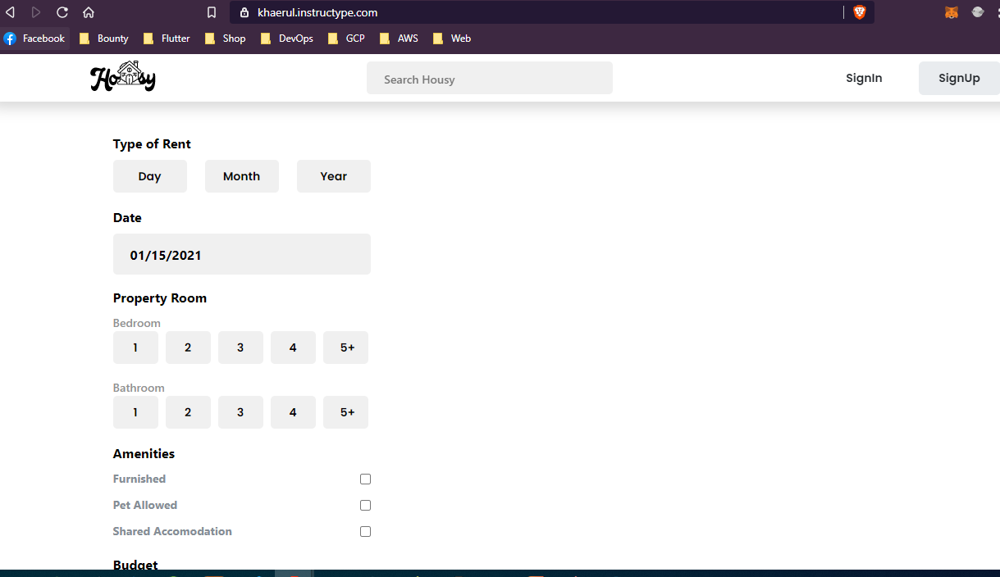

6. tambahkan SSL menggunakan let's encrypt agar website menjadi lebih aman.
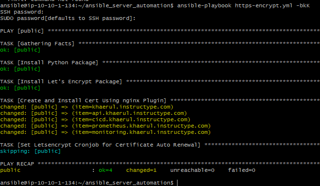