# CI/CD

1. Install jenkins menggunakan docker container pada server ansible

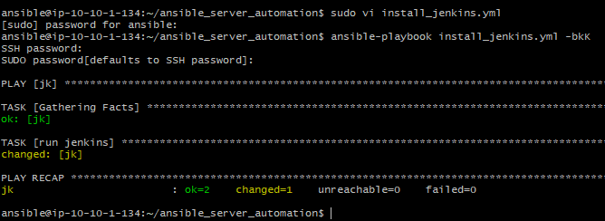

2. cek password default jenkins yang berjalan pada docker container.

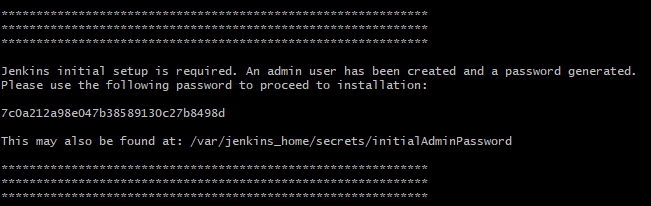

3. Lakukan instalasi jenkins dan configurasi dasar jenkins seperti install plugin, membuat user dan lainnya.

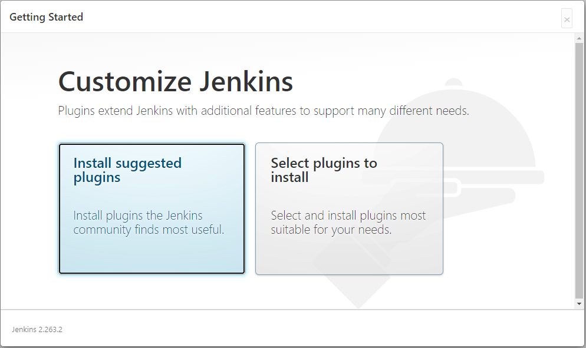
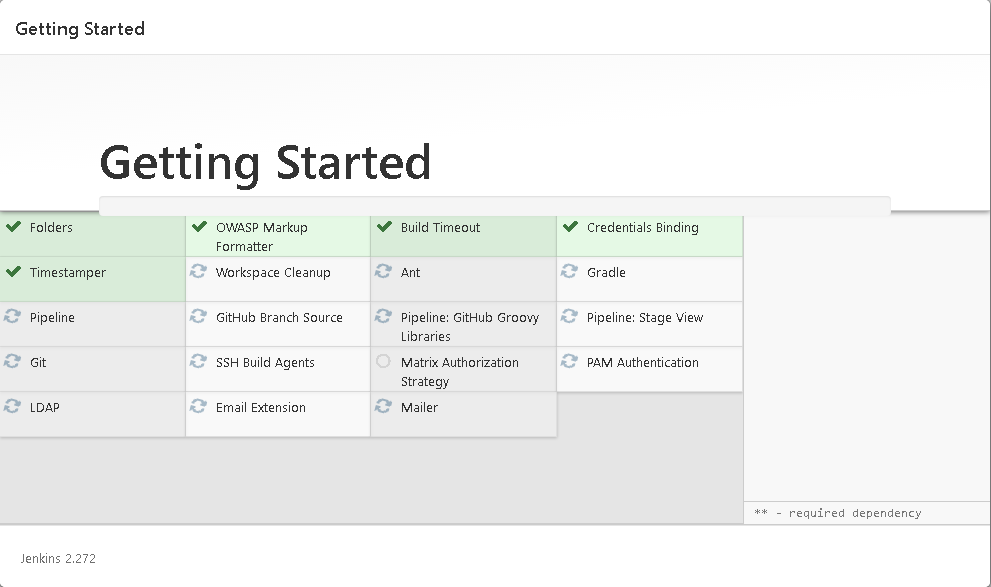
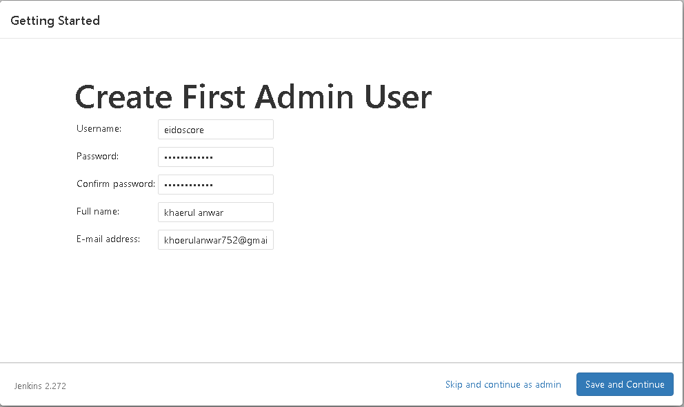

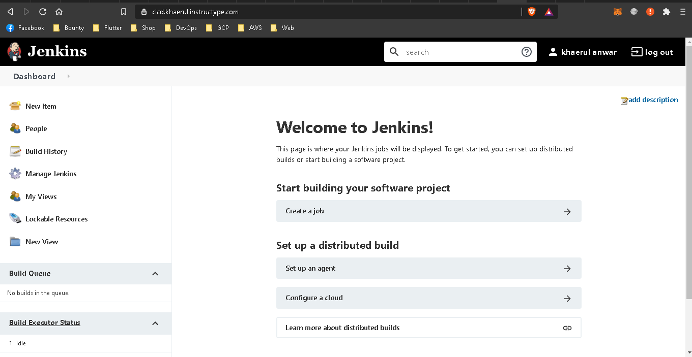

4. pertama install plugin ```publish over ssh``` pada bagian plugin, dan ```install without restart``` 

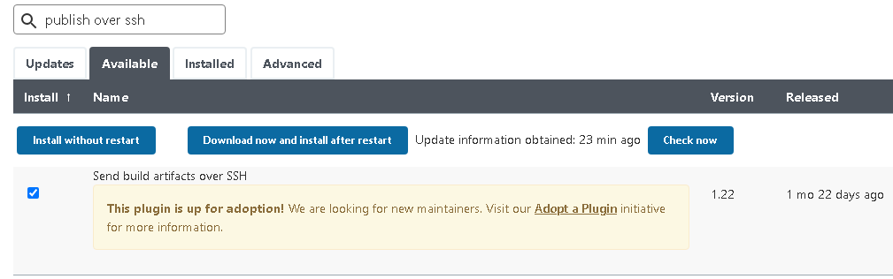

5. tambahkan credential server pada jenkins agar bisa melakukan remote ke server backend/frontend

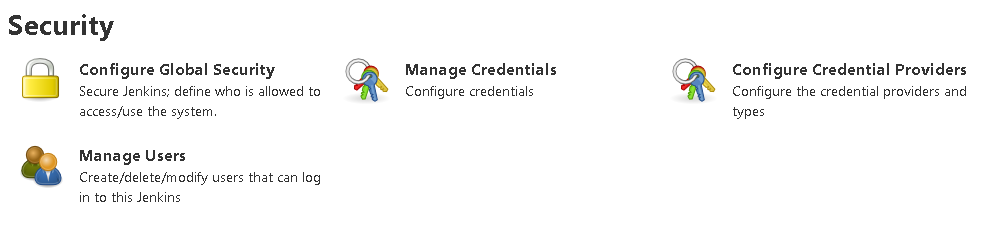
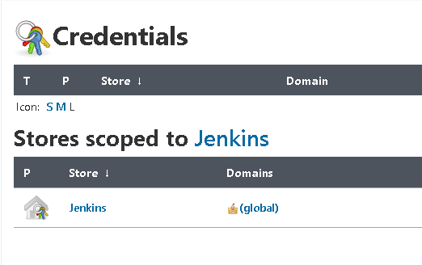
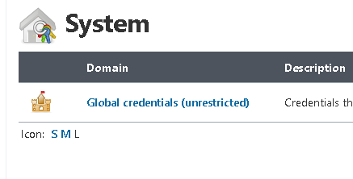
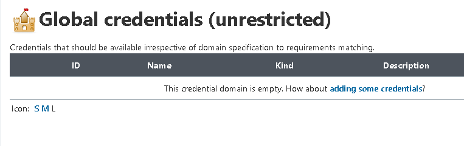
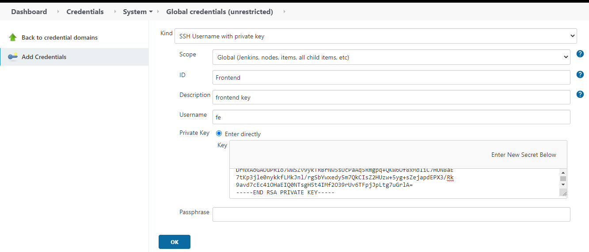

6. tambahkan server tujuan pada global config timeout set menjadi ```0``` dan lakukan test koneksi.

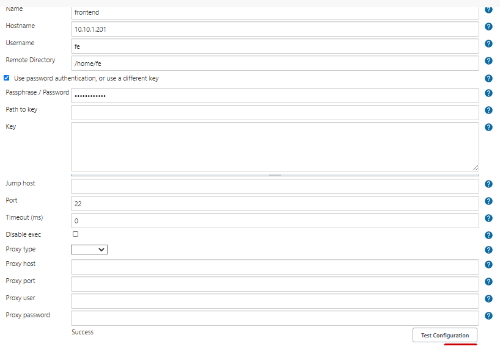
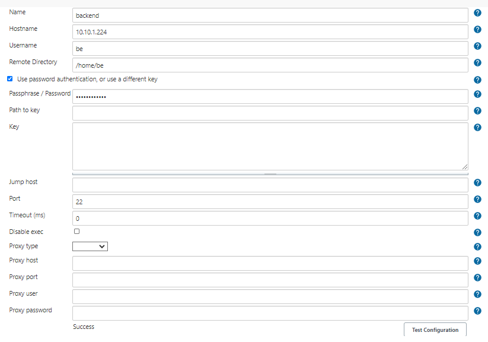

7. buat job baru pada jenkins pilih ```Freestyle project``` kemudian set seperti source code management dan trigger serta set notifikasi build.

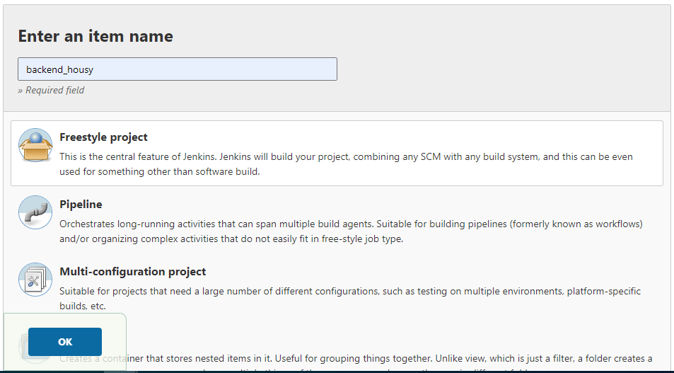
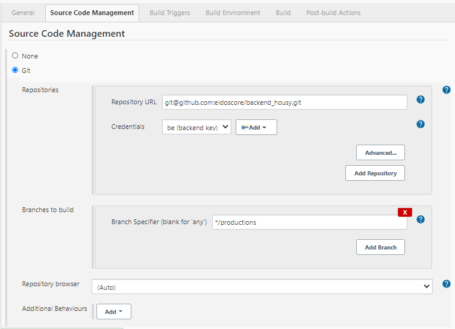
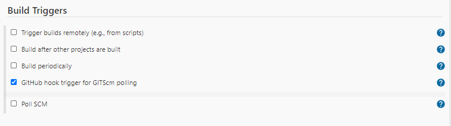

8. pada step exec command perhatikan baik-baik ini adalah step penting perhatikan command yg diberikan.

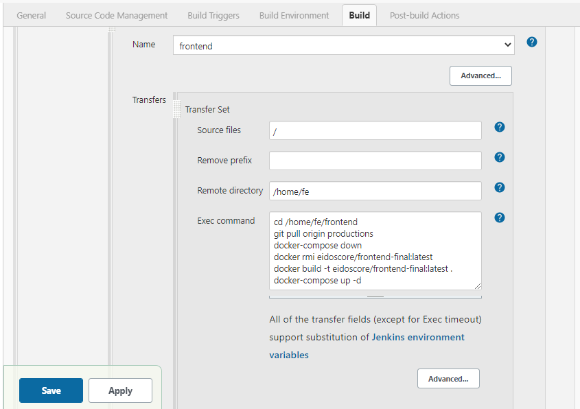

9. cek history build yang sudah dilakukan.

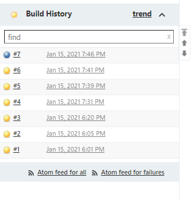
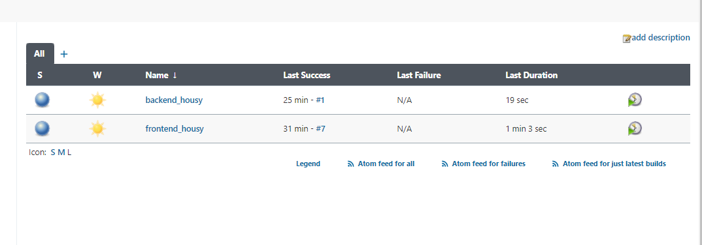

10. langkah terakhir setelah berhasil melakukan build image dan running container maka image akan di push ke docker hub.

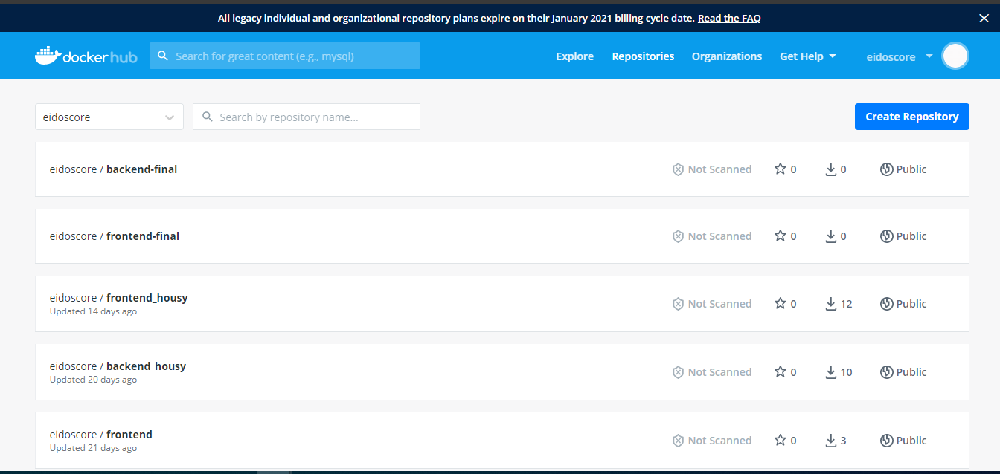