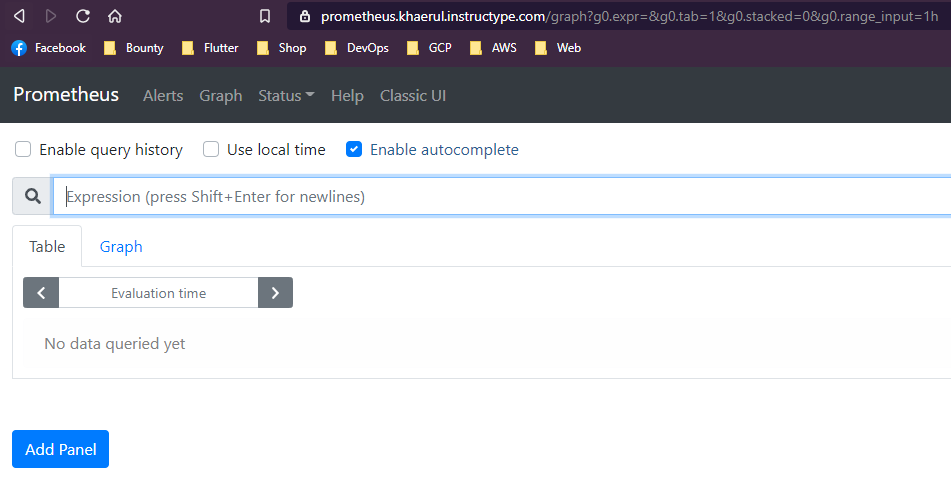

# Monitoring Server

1. jalankan perintah untuk menginstall prometheus dan grafan dari server ansible.

2. Akses prometheus menggunakan web browser dan prometheus berhasil diinstall serta semua server sudah berhasil terhubung dengan prometheus melalui node_exporter.

3. kemudian akses juga grafana yang sudah diinstall setting user baru dan tambahkan data source yang adalah dari domain prometheus

4. setting tampilan pada grafana dashboard untuk monitoring disini kita bisa membuat interface secara manual atau menggunakan template.

